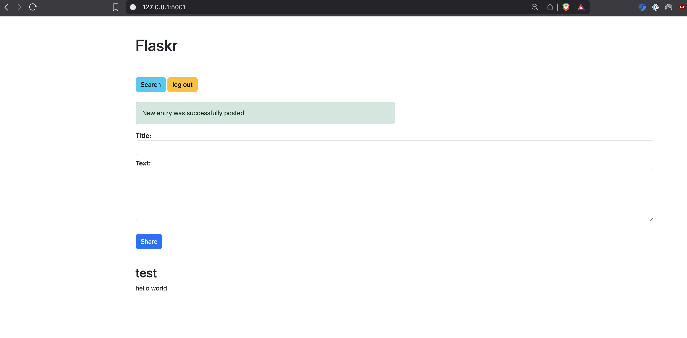

E444-F2025-PRA3 — Flask TDD + Deployment

What this repo shows:
Minimal Flask app with / returning “Hello, World!”
TDD: failing test → passing test (Red → Green), then small refactor
Deployment on Render using Gunicorn

Landing page after login and posting: 

  <a 
    
  </a>

